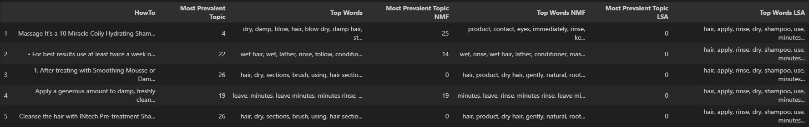

# topic_modeling

## Description
What `problem` does it `solve`?

This project identifies `topics` from text (`product descriptions`) to reveal underlying themes and highlight the `unique words` within each topic. This can be use in other `NLP` (Natural language processing) based projects.


[](./LICENSE)

[](https://cesarservin.com/topic_modeling/index.html)
[](https://github.com/cesarservin/topic_modeling/blob/main/notebooks/main.ipynb)
[](https://github.com/cesarservin/topic_modeling)


## Table of contents

- [topic_modeling](#topic_modeling)
  - [Description](#description)
  - [Table of contents](#table-of-contents)
  - [Installation](#installation)
  - [Usage](#usage)
  - [Data](#data)
  - [Model](#model)
  - [Results](#results)
  - [Examples](#examples)
  - [Documentation](#documentation)
  - [Contributing](#contributing)
  - [License](#license)
  - [Roadmap](#roadmap)
  - [Enhancements](#enhancements)
  - [Acknowledgments](#acknowledgments)
  - [Changelog](#changelog)


## Installation

⚠️ Follow the next instructions inside your project folder

1. **Prerequisites**:
   - To install the project `nlp_cpu` in your local environment
**you must have Python 3.10 or later**. Ideally, you use Python 3.11.
1. **Setup**:
   - If Hatch is not already **installed**, install it: `pip install hatch`
   - To activate your environment with `nlp_cpu` type **inside your project folder**:
`hatch shell` (in your laptop)

**That's it! You can now use your package in your local environment.**

## Usage
- **Basic Usage**: Run `topic_modeling.exe` or use `topic_modeling_main.ipynb`
- **Configuration**: Modify pyproject.toml to add or remove packages.

## Data
- **Sources**: The dataset is collected by CPG distributor public site.
- **Structure**: Table of key features


| Text      |
| :-------- |
| `string`  |


## Model

- **Algorithms**: Models or methods used.
    - LDA (Latent Dirichlet Allocation)
    - NMF (Non-Negative Matrix Factorization)
    - LSA (Latent Semantic Analysis)
- **Evaluation**:
    - Metrics: umass - based on words co-occurance

## Results
 - **Findings:**
   - Based on the model the results of topics and words are different. This is not surprising as these methods are using different approaches under the hood.

      Overall, I would prefer to go with the LDA method as is has been a well stablished methodn on this field.

- **Visualizations**:
  - Example visualizations (if applicable).
  


## Examples

```python
from nlp_cpu.data.etl import datafile_path_finder, find_nan, remove_newline_tabs_spaces
from nlp_cpu.model.nlp import top_features_sm, most_prevalent_topic, get_topic_words, topic_words_dist_ranked
```


## Documentation

[Documentation](https://cesarservin.com/topic_modeling/index.html)


## Contributing

To contribute create a PR a use conventional [commits](https://www.conventionalcommits.org/en/v1.0.0/#summary)

```
fix: <description>
feat: <description>
docs: <description>
refactor: <description>
```
## License
[License](./LICENSE) information.

## Roadmap

- Clustering of products based on text

- Find most similar product

## Enhancements
Other potential future work that can be done to extend the project or improve its functionality is use other vectorization methods such as Term frequency-inverse document frequency, word-embeddings, and transformers.

Also, find a ways to display other topics asignation, incase the decision is marginal (between 3).

Further cleaning of data such as removal of words.

## Acknowledgments

Inspired by experience and GT

## Changelog
- v1.0: Initial release with basic model implementation.
- v1.1: Added feature importance visualization and improved model performance.
